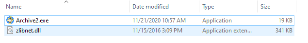
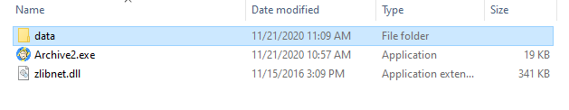

# Archive2
Archive2, supports creating GNMF BA2's,

**Requirements:**
---------------------------------------------------------------------
zlibnet
Source: https://github.com/gdalsnes/zlibnet/releases/

Download: "zlibnet.v|latest version|.zip

Tested Version: 1.3.3(use the latest version)

should you not do this, the program will atempt to download it(v1.3.3) so please download the latest version or let it download it

**Setting Up:**
---------------------------------------------------------------------
Download the latest version of zlibnet and extract the .dll in the same folder with Archive2.exe and create a folder called "data". now it should look somthing like so:

expected look:

**Usage:**
---------------------------------------------------------------------
create a folder called "data", put textures and run Archive2.exe, either do it via CMD or double click it and let it do its magic, if should output a file called "output.ba2" if none is given, renambe it to <espname - Textures.ba2>, and now you have a PS4 GNMF BA2

**Valid Arguments**:

Archive2.exe "output ba2 name"

Archive2.exe

**Credits:**
---------------------------------------------------------------------
- Kernel Panic | Backporter

- [zlibnet](https://github.com/gdalsnes/zlibnet)

**Notes:**
---------------------------------------------------------------------
* Make sure the dds are converted to GNF, this tool will not detect the texture format and it assume its already GNF

* This Repo has been re-created as the old one contained senstive infomation, old one was created Nov 2020