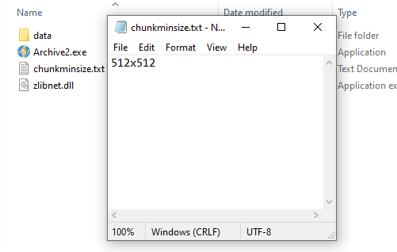

# Archive2-MutiChunk
Archive2-MutiChunk, supports creating Muti-Chunk GNMF BA2's,

**Requirements:**
---------------------------------------------------------------------
zlibnet
Source: https://github.com/gdalsnes/zlibnet/releases/

Download: "zlibnet.v|latest version|.zip

Tested Version: 1.3.3(use the latest version)

should you not do this, the program will atempt to download it(v1.3.3) so please download the latest version or let it download it

**Setting Up:**
---------------------------------------------------------------------
Download the latest version of zlibnet and extract the .dll in the same folder with Archive2.exe and create a folder called "data". now it should look somthing like so:

expected look:

**Usage:**
---------------------------------------------------------------------
Firstly; you need to determine what the lowest resolution you want the last mip to be, in most cases i'd recomend 512x512 or 1024x1024
(each mip is half of the main, so 4096 /2 : 2048 || 2048 /2 : 1024 || 1024 /2 : 512), once you decide what you want it to be, create a text document with the name "chunkminsize.txt" and input the height x width and save it. it should look somthing like this:

if none is given, the app will default to 512x512;

create a folder called "data", put textures(both DDS and GNF) and run Archive2.exe, either do it via CMD or double click it and let it do its magic, if should output a file called "output.ba2" if none is given, renambe it to <espname - Textures.ba2>, and now you have a PS4 GNMF BA2

**Valid Arguments**:

"output ba2 name" && "-nc" && "-nst" && "-h" && "--help"

"-nc" enables no compression mode

"-nst" enables No String Table mode

**Credits:**
---------------------------------------------------------------------
- Kernel Panic | Backporter

- [zlibnet](https://github.com/gdalsnes/zlibnet)

**Notes:**
---------------------------------------------------------------------
* This tool will require both GNF and DDS, and each need to be named based off what they are.

# Info
Why is it important to have mipmapping you may ask, please refer to [This](https://en.wikipedia.org/wiki/Mipmap) for info on why mip-mapping is important, the main benefit is better performance, in this case, with the weak performance on the PS4 this will help a lot.
